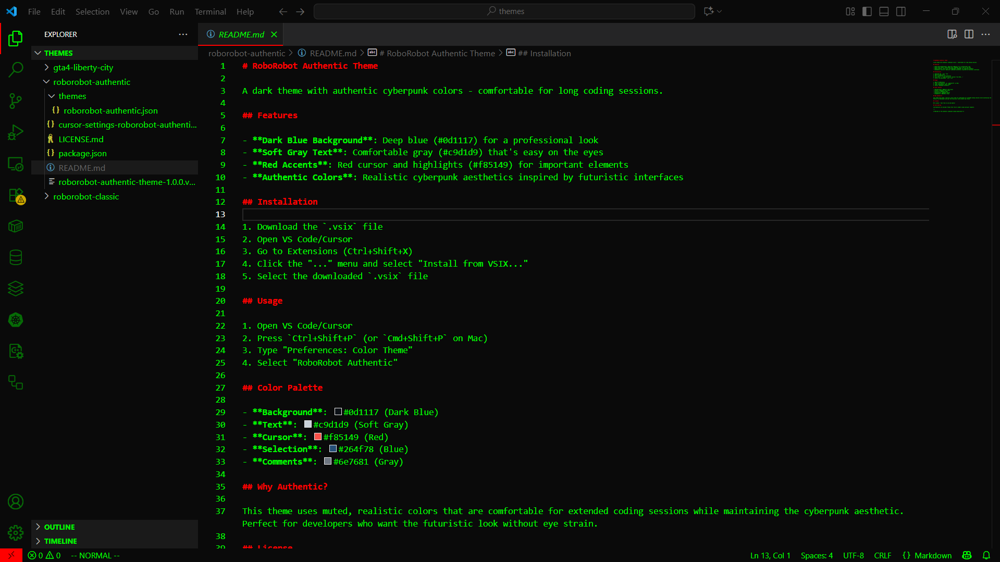

# 🎨 VSCode Themes Collection

Коллекция тем для VSCode редактора.

## 📁 Структура

```
MY_VSCODE_THEMES/
├── themes/
│   ├── roborobot-authentic/
│   ├── roborobot-classic/
│   ├── gta4-liberty-city/
│   └── другие темы...
└── README.md
```

## 🚀 Установка тем

### Способ 1: Через Command Palette
1. `Ctrl + Shift + P`
2. `Preferences: Color Theme`
3. Выберите нужную тему из списка

### Способ 2: Копирование в папку расширений
```powershell
# PowerShell
New-Item -ItemType Directory -Force -Path "$env:USERPROFILE\.vscode\extensions"
Copy-Item -Path ".\themes\*" -Destination "$env:USERPROFILE\.vscode\extensions\" -Recurse -Force
```

### Способ 3: Через settings.json
```json
{
    "workbench.colorTheme": "theme-name"
}
```

## 🔧 Быстрая установка всех тем

### PowerShell (рекомендуется)
```powershell
# Для VSCode
New-Item -ItemType Directory -Force -Path "$env:USERPROFILE\.vscode\extensions"
Copy-Item -Path ".\themes\*" -Destination "$env:USERPROFILE\.vscode\extensions\" -Recurse -Force

Write-Host "Все темы установлены!" -ForegroundColor Green
```

### Command Prompt
```cmd
# Для VSCode
mkdir "%USERPROFILE%\.vscode\extensions" 2>nul
xcopy ".\themes\*" "%USERPROFILE%\.vscode\extensions\" /E /I /Y

echo Все темы установлены!
```

## 📋 Доступные темы

### 🤖 RoboRobot Authentic Theme
Аутентичная робот-тема с приглушенными цветами для комфортной работы.


**Особенности:**
- Темно-синий фон (#0d1117) для профессионального вида
- Мягкий серый текст (#c9d1d9) для комфорта глаз
- Красные акценты (#f85149) для важных элементов
- Реалистичная киберпанк эстетика

### 🤖 RoboRobot Classic Theme
Классическая робот-тема с яркими матричными цветами.



**Особенности:**
- Глубокий черный фон (#0a0a0a) для максимального контраста
- Ярко-зеленый текст (#00ff00) в стиле матрицы
- Красные акценты (#ff0000) для курсора и выделений
- Терминальная эстетика для футуристического кодинга

### 🏙️ GTA IV Liberty City Theme
Тема в стиле Grand Theft Auto IV с атмосферой Liberty City.


**Особенности:**
- Оранжевые акценты в стиле GTA IV
- Городские цвета и неоновые подсветки
- Атмосфера Liberty City
- Темная тема с яркими акцентами

## 🔄 После установки

1. Перезапустите VSCode
2. `Ctrl + Shift + P` → `Developer: Reload Window`
3. `Ctrl + Shift + P` → `Preferences: Color Theme`
4. Выберите нужную тему

## ⚠️ Важно

- Убедитесь, что у вас есть права на запись в папку расширений
- Сделайте бэкап существующих тем перед установкой
- Проверьте, что в папке темы есть файл `package.json`

## 🛠️ Troubleshooting

### Тема не появляется в списке
1. Проверьте структуру папки темы (должен быть `package.json`)
2. Перезапустите VSCode
3. Проверьте права доступа к папке расширений

### Ошибки при копировании
1. Запустите PowerShell/CMD от имени администратора
2. Проверьте пути к папкам
3. Убедитесь, что папки существуют

## 🔄 Обновление репозитория

```bash
git add .
git commit -m "Update VSCode themes collection"
git push origin main
```